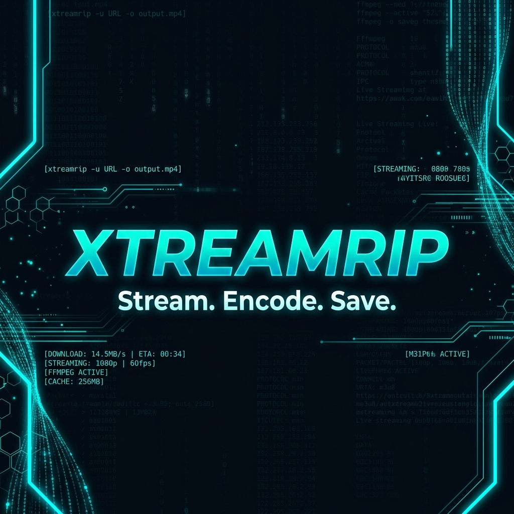
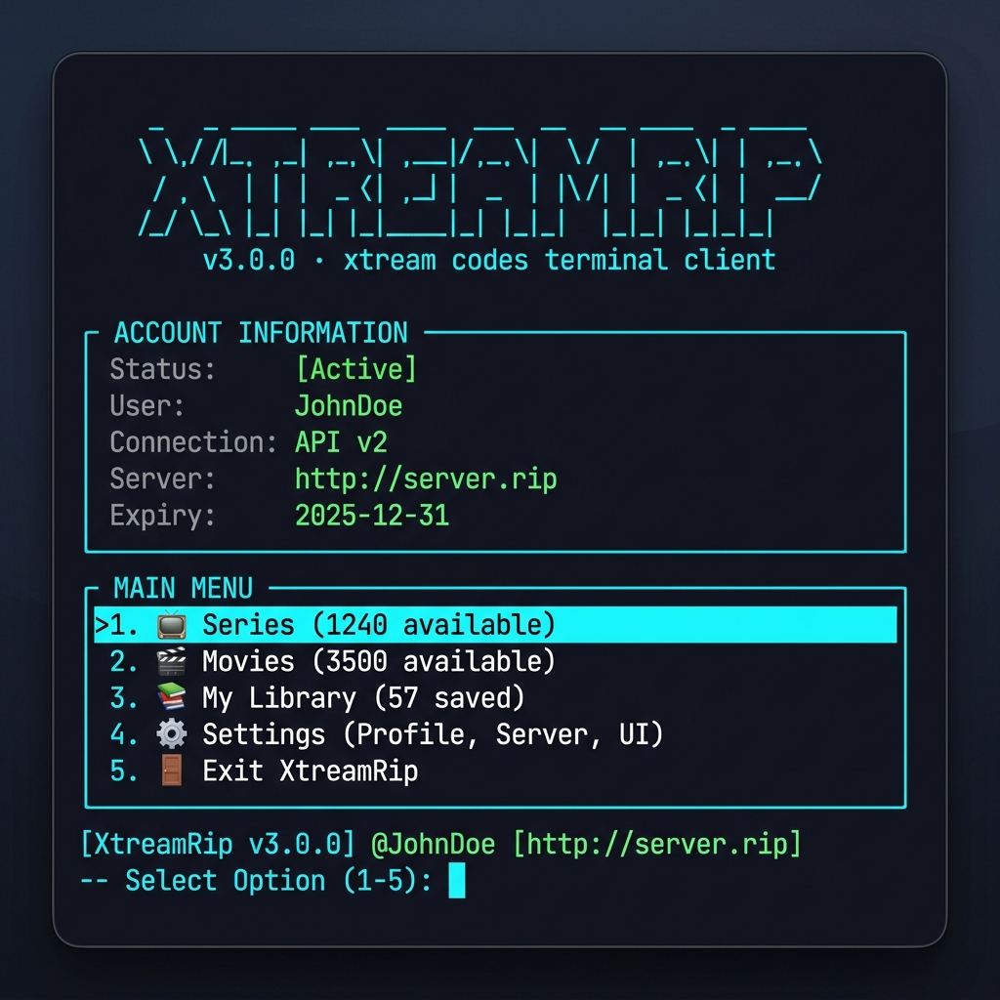
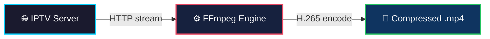
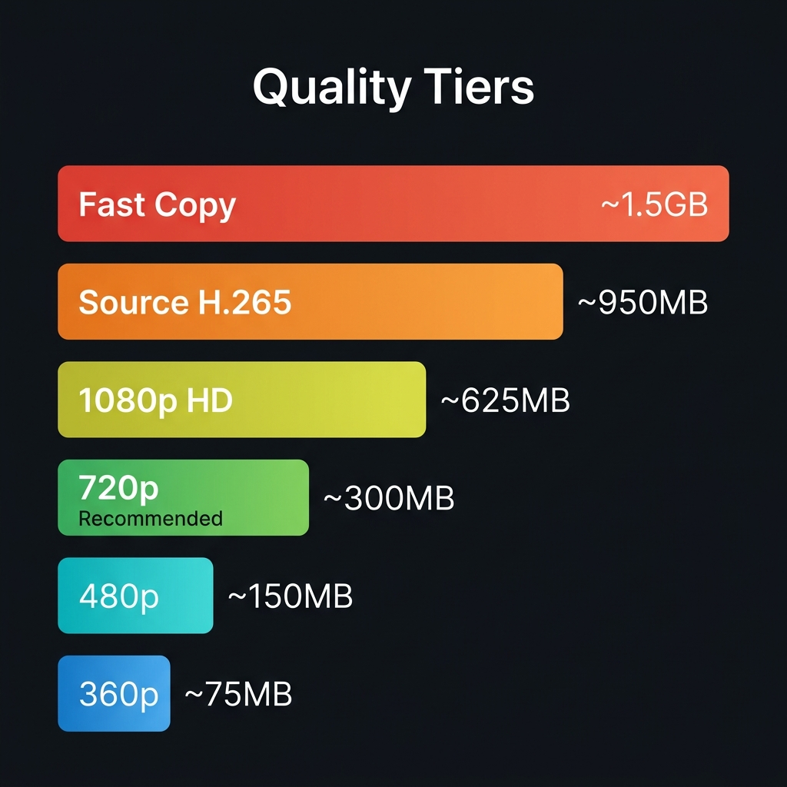
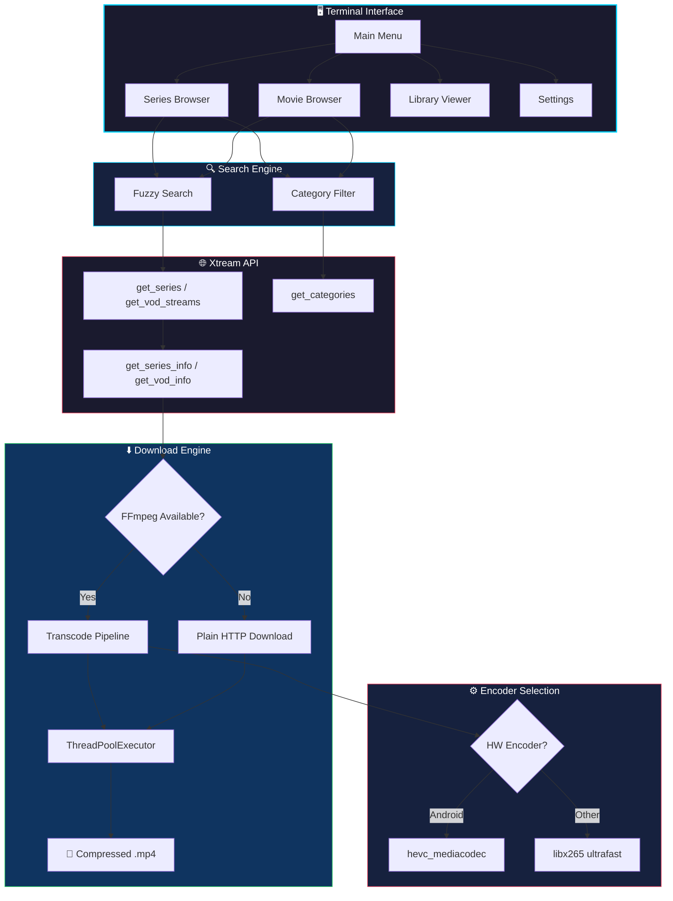
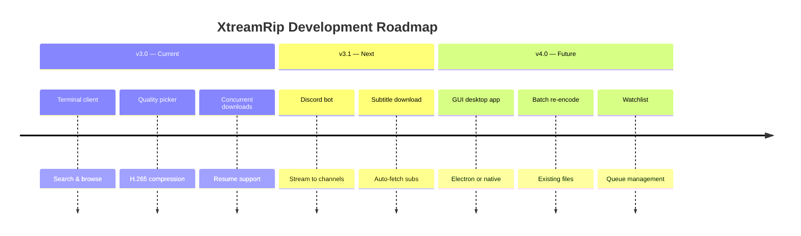

<div align="center">



<br/>

### Stream. Encode. Save.

**The ultimate terminal client for Xtream Codes IPTV.**
Search your catalog, pick quality, compress with H.265, and download — all from the command line.
No browser. No ads. No bloat.

<br/>

[](https://github.com/MayonaiseLover/XtreamRip/stargazers)
[](https://github.com/MayonaiseLover/XtreamRip/network/members)
[](https://github.com/MayonaiseLover/XtreamRip/issues)
[](LICENSE)

[](https://python.org)
[](https://ffmpeg.org)
[](#platform-support)

<br/>

</div>

---

<div align="center">



<br/><br/>

</div>

## ⚡ Highlights

<table>
<tr>
<td width="50%">

### 🔍 Smart Search
Fuzzy search that finds results even with typos. `"brking bad"` → **Breaking Bad**. Browse by category when you don't know what you want.

</td>
<td width="50%">

### 🎯 Quality Picker
Choose your quality **before** downloading. See estimated file sizes upfront. From lossless copy to 360p sharing-friendly.

</td>
</tr>
<tr>
<td width="50%">

### ⚡ Stream → Encode → Save
FFmpeg reads directly from the stream URL and encodes on the fly. **The raw file never touches your disk.** Bandwidth used ≈ output file size.

</td>
<td width="50%">

### 🖥️ Hardware Acceleration
Auto-detects `hevc_mediacodec` on Android for near-realtime H.265 encoding. Software `libx265` fallback on all other platforms.

</td>
</tr>
<tr>
<td width="50%">

### 📦 Concurrent Downloads
Download multiple files simultaneously, auto-capped to your server's connection limit. No manual tuning required.

</td>
<td width="50%">

### 🔁 Resume & Skip
Interrupted downloads pick up where they left off. Already-downloaded files are detected and skipped automatically.

</td>
</tr>
</table>

---

## 📊 How Compression Works

Most IPTV streams are delivered as H.264. **H.265 (HEVC) achieves the same visual quality at roughly half the file size.**

The key insight: FFmpeg reads directly from the stream URL rather than downloading first. It pulls, encodes on the fly, and writes only the compressed output.



> **💡 The raw uncompressed file never exists on disk.** Your bandwidth usage equals the size of the compressed output, not the source stream.

<div align="center">



</div>

---

## 🚀 Quick Start

### 1. Clone

```bash
git clone https://github.com/MayonaiseLover/XtreamRip.git
cd XtreamRip
```

### 2. Install Dependencies

```bash
pip install -r requirements.txt
```

### 3. Run

```bash
python iptv_dl.py
```

On first launch, you'll be prompted for your IPTV server URL, username, and password. Credentials are saved locally to `~/.config/xtreamrip/creds.json` and never asked again.

### Install FFmpeg (Recommended)

FFmpeg enables H.265 compression. Without it, files download uncompressed.

| Platform | Command |
|:---------|:--------|
| 🤖 Android (Termux) | `pkg install ffmpeg` |
| 🐧 Ubuntu / Debian | `sudo apt install ffmpeg` |
| 🍎 macOS | `brew install ffmpeg` |
| 🪟 Windows | [ffmpeg.org/download](https://ffmpeg.org/download.html) → add to PATH |

---

## 📖 Usage

```bash
python iptv_dl.py             # launch
python iptv_dl.py --reset     # change saved credentials
python iptv_dl.py --version   # print version
```

### Main Menu

```
? What do you want to do?
  📺  Series
  🎬  Movies
  📚  My Library
  ⚙   Settings
  🔑  Change credentials
  🚪  Exit
```

### Searching

Type part of a name — fuzzy search means `"brking bad"` still finds **Breaking Bad**.  
Or browse by category (Action, Drama, Sci-Fi…) and filter within it.

### Season & Episode Picker

```
? Which seasons?
  📥  ALL seasons  (62 episodes total)
  ○   Season  1   (10 episodes)
  ○   Season  2   (10 episodes)
  ...

  SPACE = toggle    ENTER with nothing selected = grab ALL
```

### Quality Selection

Shown once per download batch, before anything starts:

```
? Pick quality:
  🚀  Fast copy       no encoding, original file     (~1–2 GB/ep, instant, zero CPU)
  📺  Source quality   H.265, original resolution     (~700 MB – 1.2 GB/ep)
  🔥  1080p HD        H.265                          (~450 – 800 MB/ep)
  ✅  720p            best size / quality balance     (~200 – 400 MB/ep)
  💾  480p            smaller, still great on phone   (~100 – 200 MB/ep)
  📱  360p            compact, sharing friendly       (~50 – 100 MB/ep)
```

> **💡 Tip:** Fast copy remuxes in seconds with zero CPU usage and no quality loss — perfect when you just want the file now.

### Output Structure

```
📁 Download folder
└── The Boys/
    ├── Season 01/
    │   ├── S01E01 - The Name of the Game.mp4
    │   └── S01E02 - Cherry.mp4
    └── Season 02/
        └── S02E01 - The Big Ride.mp4
```

---

## 🎛️ Architecture



---

## ⚙️ Configuration

Launch the app → **⚙ Settings**

| Setting | Default | Description |
|:--------|:--------|:------------|
| `crf` | `20` | H.265 quality. `18` = near-lossless · `28` = smallest file |
| `workers` | `2` | Concurrent downloads. Auto-capped to server's connection limit |
| `download_dir` | *current dir* | Where files are saved |
| `skip_existing` | `true` | Skip files that are already on disk |
| `notify` | `true` | Termux push notification when a batch completes |

Config is stored at `~/.config/xtreamrip/config.json`.

---

## 🖥️ Platform Support

| Platform | Status | Notes |
|:---------|:-------|:------|
| 🤖 Android (Termux) | ✅ Full | Hardware H.265 encoding on most devices |
| 🐧 Linux | ✅ Full | Software encoding via libx265 |
| 🍎 macOS | ✅ Full | Install ffmpeg via Homebrew |
| 🪟 Windows | ⚠️ Partial | Works in WSL; native requires ffmpeg on PATH |

---

## 📋 Feature List

| Feature | Status | Description |
|:--------|:------:|:------------|
| Fuzzy search | ✅ | Finds results with partial/wrong spelling |
| Category browsing | ✅ | Browse by genre |
| Series support | ✅ | Full season/episode picker with info panels |
| Movie support | ✅ | Search, browse, multi-select download |
| Quality picker | ✅ | 6 tiers with estimated sizes |
| H.265 hardware encoding | ✅ | `hevc_mediacodec` on Android |
| H.265 software encoding | ✅ | `libx265 ultrafast` fallback |
| Stream-to-encode pipeline | ✅ | Raw file never stored |
| Concurrent downloads | ✅ | Auto-capped to server limit |
| Resume interrupted downloads | ✅ | Automatic resume |
| Smart skip | ✅ | Already-downloaded detection |
| Download history | ✅ | Local log with size and date |
| Termux notifications | ✅ | Push alert when batch finishes |
| Persistent settings | ✅ | Saved across sessions |
| Account dashboard | ✅ | Subscription info on startup |
| Discord bot | 🔜 | Stream to Discord channels |
| GUI desktop app | 📋 | Planned |
| Subtitle download | 📋 | Planned |
| Batch re-encode | 📋 | Planned |

---

## 🗺️ Roadmap



---

## 🤝 Contributing

We welcome contributions! See [CONTRIBUTING.md](CONTRIBUTING.md) for guidelines.

1. Fork the repo
2. Create a feature branch (`git checkout -b feature/amazing-feature`)
3. Commit your changes (`git commit -m 'feat: add amazing feature'`)
4. Push to the branch (`git push origin feature/amazing-feature`)
5. Open a Pull Request

---

## 📈 Star History

<div align="center">

[](https://star-history.com/#MayonaiseLover/XtreamRip&Date)

</div>

---

## 📄 License

MIT — see [LICENSE](LICENSE) for details.

---

## ⚠️ Disclaimer

This tool is intended for use with your own paid Xtream Codes IPTV subscription. Downloading content you have legitimate access to for personal use is generally considered fair use. You are responsible for complying with your provider's terms of service and applicable copyright laws in your jurisdiction.

---

<div align="center">

<br/>

**If XtreamRip saves you time, consider giving it a ⭐**

<br/>

Built with ❤️ by [Mazen Haitham](https://github.com/MayonaiseLover)

<sub>Python · FFmpeg · Rich · Questionary</sub>

<br/><br/>

</div>
